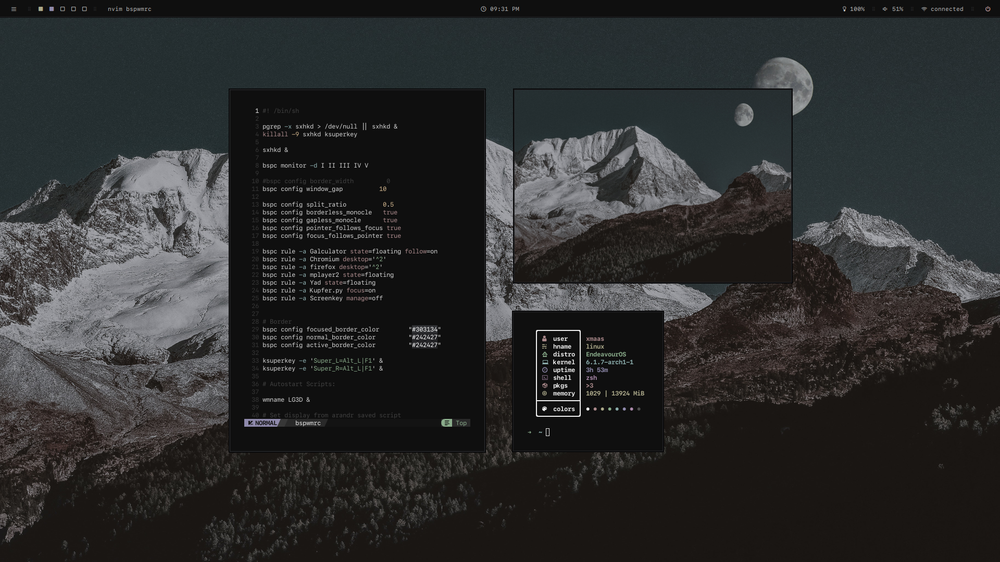

<h2 align="center"> 
 <samp> dotfiles  </samp>
</h2>

  

## <samp> .info </samp>
- **Operating System:** [EndeavourOS](https://endeavouros.com/)
- **Window Manager:** [bspwm](https://github.com/baskerville/bspwm)
- **Terminal:** [kitty](https://sw.kovidgoyal.net/kitty/)
- **Shell:** [zsh](https://www.zsh.org/)
- **Panel:** [polybar](https://github.com/polybar/polybar)
- **color scheme:** [mountain](https://github.com/mountain-theme/Mountain)
- **Application Launcher:** [rofi](https://github.com/davatorium/rofi)
- **fetch:** [nitch](https://github.com/unxsh/nitch)

## <samp> .credits </samp>
- Rofi configs was taken from [archcraft os](https://archcraft.io/flavors.html)
- Polybar modules was taken from [adi1090x](https://github.com/adi1090x/polybar-themes)
