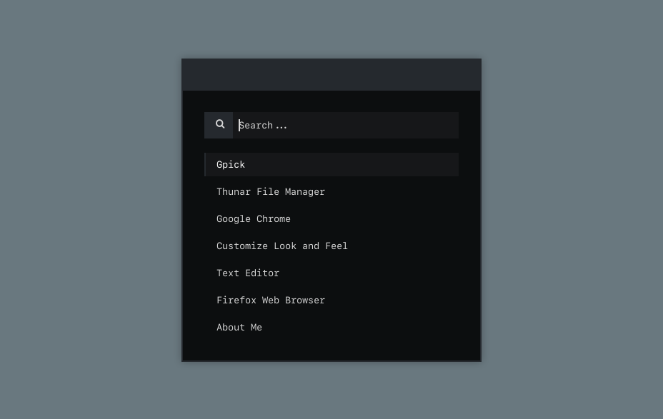
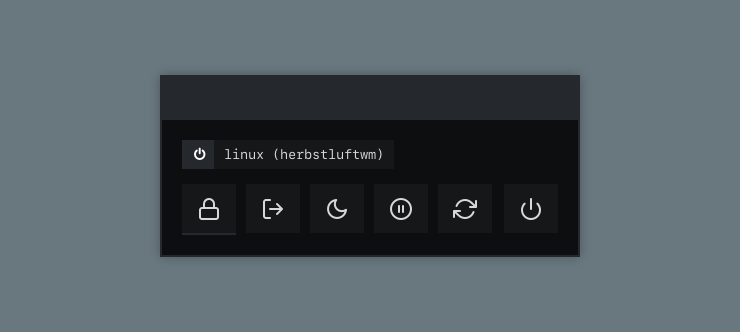
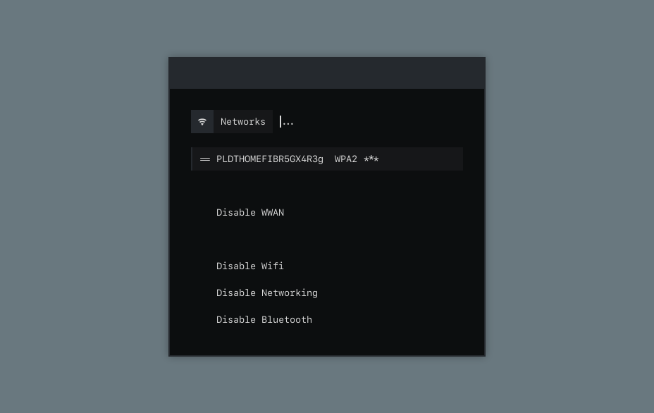

<h1 align="center"> 
 <samp> Mint ft. Herbstluftwm  </samp>
</h1>

  

<h2>
  <samp>Launchers & Applets</samp>
</h2>

|Launcher|Powermenu|Screenshot|Network|Bluetooth|
|--|--|--|--|--|
||||||

<h2>
  <samp>Installation</samp>
</h2>

(WIP) Just manually install it yourself for now.

<h2>
  <samp>Information</samp>
</h2>

- **Operating System:** [Linux Mint](https://linuxmint.com/)
- **Window Manager:** [herbstluftwm](https://herbstluftwm.org/)
- **Terminal:** [kitty](https://sw.kovidgoyal.net/kitty/)
- **Shell:** [zsh](https://www.zsh.org/)
- **Panel:** [polybar](https://github.com/polybar/polybar)
- **color scheme:** [yoru](https://github.com/rxyhn/yoru)
- **Application Launcher:** [rofi](https://github.com/davatorium/rofi)
- **fetch:** [nitch](https://github.com/unxsh/nitch)

<h2>
  <samp>Credits</samp>
</h2>

Most of the config in this dotfile is taken from [archcraft/herbstluftwm](https://github.com/archcraft-os/archcraft-herbstluftwm). I am too lazy and dumb to create my own scripts.  
Credits to [adi1090x](https://github.com/adi1090x) for providing awesome resources.
